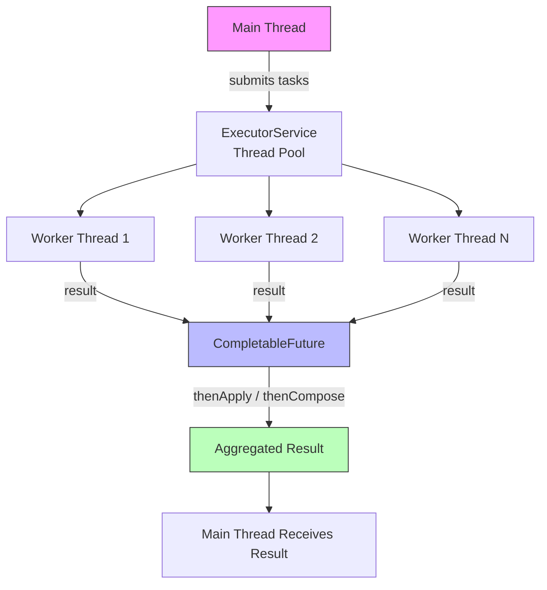

# Java Concurrency — Complete Guide

> **Full Tutorial:** Read the complete guide at [https://howtostartprogramming.in/java-concurrency/](https://howtostartprogramming.in/java-concurrency/)


---

## 📋 Problem Statement

Java applications often need to perform multiple tasks simultaneously — handling HTTP requests, processing data in parallel, or coordinating background jobs. Java's concurrency model, built on threads and higher-level abstractions like `ExecutorService` and `CompletableFuture`, provides the tools to write safe, efficient multi-threaded programs.

This tutorial covers:
- Thread lifecycle and synchronization
- `ExecutorService` and thread pools
- `CompletableFuture` for async pipelines
- Locks, semaphores, and concurrent collections
- Common pitfalls: deadlocks, race conditions, and memory visibility

---

## 🏗️ Architecture Diagram



---

## 📂 Code Structure

```
java-concurrency/
├── src/main/java/in/howtostartprogramming/concurrency/
│   ├── ThreadBasicsExample.java         # Thread creation and lifecycle
│   ├── ExecutorServiceExample.java      # Thread pool patterns
│   ├── CompletableFutureExample.java    # Async pipelines
│   ├── SynchronizationExample.java     # synchronized, locks, semaphores
│   └── ConcurrentCollectionsExample.java # ConcurrentHashMap, BlockingQueue
└── pom.xml
```

---

## 💡 Code Explanation

### 1. Thread Basics

```java
// Creating a thread using Runnable
Thread thread = new Thread(() -> {
    System.out.println("Running in: " + Thread.currentThread().getName());
});
thread.start();
thread.join(); // wait for completion
```

### 2. ExecutorService — Fixed Thread Pool

```java
ExecutorService executor = Executors.newFixedThreadPool(4);

List<Future<Integer>> futures = new ArrayList<>();
for (int i = 0; i < 10; i++) {
    final int taskId = i;
    futures.add(executor.submit(() -> {
        // simulate work
        Thread.sleep(100);
        return taskId * taskId;
    }));
}

for (Future<Integer> f : futures) {
    System.out.println("Result: " + f.get());
}
executor.shutdown();
```

### 3. CompletableFuture — Async Pipeline

```java
CompletableFuture<String> pipeline = CompletableFuture
    .supplyAsync(() -> fetchUserId())           // Step 1: fetch ID
    .thenApplyAsync(id -> fetchUser(id))        // Step 2: fetch user
    .thenApplyAsync(user -> enrichUser(user))   // Step 3: enrich
    .exceptionally(ex -> {
        log.error("Pipeline failed", ex);
        return User.empty();
    });

String result = pipeline.get(5, TimeUnit.SECONDS);
```

### 4. Combining Multiple Futures

```java
CompletableFuture<UserProfile> profile  = fetchProfileAsync(userId);
CompletableFuture<List<Order>> orders   = fetchOrdersAsync(userId);
CompletableFuture<AccountInfo> account  = fetchAccountAsync(userId);

CompletableFuture<Dashboard> dashboard = CompletableFuture
    .allOf(profile, orders, account)
    .thenApply(v -> Dashboard.builder()
        .profile(profile.join())
        .orders(orders.join())
        .account(account.join())
        .build());
```

### 5. ReentrantLock for Fine-Grained Control

```java
private final ReentrantLock lock = new ReentrantLock();
private int counter = 0;

public void increment() {
    lock.lock();
    try {
        counter++;
    } finally {
        lock.unlock(); // always unlock in finally
    }
}
```

---

## 🔧 Build Instructions

### Prerequisites

- Java 17 or higher
- Maven 3.8+

### Run Examples

```bash
# Clone the repository
git clone https://github.com/Rajesh1761/howtostartprogramming-code-examples.git
cd howtostartprogramming-code-examples/java/java-concurrency

# Compile
mvn compile

# Run a specific example
mvn exec:java -Dexec.mainClass="in.howtostartprogramming.concurrency.CompletableFutureExample"
```

---

## ⚠️ Common Pitfalls

| Pitfall | Description | Fix |
|---------|-------------|-----|
| **Race Condition** | Multiple threads read-modify-write shared state unsafely | Use `synchronized`, locks, or `AtomicInteger` |
| **Deadlock** | Two threads wait on each other's locks forever | Acquire locks in consistent order; use `tryLock()` with timeout |
| **Memory Visibility** | Changes in one thread not visible to another | Use `volatile`, `synchronized`, or `java.util.concurrent` types |
| **Thread Starvation** | Low-priority threads never get CPU time | Use fair locks: `new ReentrantLock(true)` |

---

## 📖 Related Tutorials

- [Java Streams](../java-streams/) — functional-style data processing
- [Mockito](../mockito/) — how to unit test concurrent code
- [Spring Batch](../../spring-boot/spring-batch/) — parallel batch processing with Spring

---

## 🌐 Full Tutorial

Read the complete guide with diagrams and code walkthroughs:

**[https://howtostartprogramming.in/java-concurrency/](https://howtostartprogramming.in/java-concurrency/)**
